# 🤖 AI Tender Analysis - Architecture & Flow Diagrams

This document provides comprehensive Mermaid diagrams to visualize the AI Tender Analysis system architecture, workflows, and data flows.

---

## 📊 Table of Contents

1. [System Architecture Overview](#1-system-architecture-overview)
2. [AI Analysis Workflow](#2-ai-analysis-workflow)
3. [Document Processing Pipeline](#3-document-processing-pipeline)
4. [API Integration Architecture](#4-api-integration-architecture)
5. [Data Flow Diagram](#5-data-flow-diagram)
6. [User Interface Flow](#6-user-interface-flow)
7. [Analysis Components Breakdown](#7-analysis-components-breakdown)
8. [Error Handling & Retry Logic](#8-error-handling--retry-logic)
9. [Database & Storage Schema](#9-database--storage-schema)
10. [Deployment Architecture](#10-deployment-architecture)

---

## 1. System Architecture Overview


---

## 2. AI Analysis Workflow

```mermaid
sequenceDiagram
    participant User
    participant WebUI
    participant FlaskAPI
    participant AIAnalyzer
    participant DocProcessor
    participant OpenAI
    participant MarketSearch
    participant ReportGen

    User->>WebUI: Click "🤖 تحليل" button
    WebUI->>FlaskAPI: POST /api/tender/{id}/analyze
    
    FlaskAPI->>AIAnalyzer: Start analysis task
    AIAnalyzer-->>FlaskAPI: Return task_id
    FlaskAPI-->>WebUI: Return {task_id, status: "started"}
    
    WebUI->>WebUI: Show progress modal
    
    loop Progress Polling
        WebUI->>FlaskAPI: GET /api/tender/{id}/status
        FlaskAPI-->>WebUI: Return progress %
        WebUI->>WebUI: Update progress bar
    end
    
    par Document Processing
        AIAnalyzer->>DocProcessor: Extract text from PDFs
        DocProcessor->>DocProcessor: Run OCR on scanned docs
        DocProcessor->>DocProcessor: Parse Excel BOQ
        DocProcessor-->>AIAnalyzer: Combined text data
    end
    
    AIAnalyzer->>OpenAI: Analyze tender requirements
    OpenAI-->>AIAnalyzer: Structured requirements
    
    AIAnalyzer->>MarketSearch: Search for similar projects
    MarketSearch-->>AIAnalyzer: Market data & prices
    
    AIAnalyzer->>OpenAI: Financial evaluation
    OpenAI-->>AIAnalyzer: Cost breakdown & pricing
    
    AIAnalyzer->>OpenAI: Technical evaluation
    OpenAI-->>AIAnalyzer: Feasibility assessment
    
    AIAnalyzer->>OpenAI: Generate recommendations
    OpenAI-->>AIAnalyzer: Priority & bid strategy
    
    AIAnalyzer->>ReportGen: Create PDF report
    ReportGen->>ReportGen: Render HTML template
    ReportGen->>ReportGen: Convert to PDF
    ReportGen-->>AIAnalyzer: PDF path
    
    AIAnalyzer-->>FlaskAPI: Analysis complete
    FlaskAPI-->>WebUI: {status: "complete", results}
    
    WebUI->>WebUI: Show results modal
    User->>WebUI: Click "View Report"
    WebUI->>FlaskAPI: GET /api/tender/{id}/report.pdf
    FlaskAPI-->>WebUI: PDF file
    WebUI->>User: Download/Display PDF
```



---

## 3. Document Processing Pipeline

```mermaid
flowchart TD
    Start([Start Document Processing]) --> FindFolder[Find Tender Folder in downloads/]
    
    FindFolder --> ListFiles[List All Files in Folder]
    
    ListFiles --> CheckFileType{Check File Type}
    
    CheckFileType -->|PDF| IsPDFScanned{Is Scanned PDF?}
    CheckFileType -->|Excel| ProcessExcel[Extract Tables & BOQ]
    CheckFileType -->|Word| ProcessWord[Extract Text with python-docx]
    CheckFileType -->|Image| ProcessImage[Run OCR with Tesseract]
    
    IsPDFScanned -->|Yes| RunOCR[Run OCR with pytesseract]
    IsPDFScanned -->|No| ExtractPDF[Extract text with pdfplumber]
    
    RunOCR --> CleanText[Clean & Normalize Arabic Text]
    ExtractPDF --> CleanText
    ProcessExcel --> CleanText
    ProcessWord --> CleanText
    ProcessImage --> CleanText
    
    CleanText --> StructureData[Structure Data by Document Type]
    
    StructureData --> CombineData[Combine All Extracted Content]
    
    CombineData --> SaveCache{Save to Cache?}
    
    SaveCache -->|Yes| CacheFile[Save to analysis_cache/{tender_id}.json]
    SaveCache -->|No| ReturnData[Return Structured Data]
    
    CacheFile --> ReturnData
    
    ReturnData --> End([End - Ready for AI Analysis])
    
    style Start fill:#90EE90
    style End fill:#FFB6C1
    style RunOCR fill:#FFD700
    style CleanText fill:#87CEEB
```

---

## 4. API Integration Architecture


---

## 5. Data Flow Diagram


---

## 6. User Interface Flow

```mermaid
stateDiagram-v2
    [*] --> HomePage: User visits app
    
    HomePage --> TenderList: Fetch tenders
    
    TenderList --> TenderSelected: User clicks tender
    
    TenderSelected --> DownloadDocs: Click "📥 Download"
    TenderSelected --> AnalyzeTender: Click "🤖 Analyze"
    
    DownloadDocs --> DownloadProgress: Show progress
    DownloadProgress --> DownloadComplete: Files saved
    DownloadComplete --> TenderSelected: Return to tender
    
    AnalyzeTender --> AnalysisProgress: Show progress modal
    
    state AnalysisProgress {
        [*] --> ExtractingDocs: Step 1
        ExtractingDocs --> RunningOCR: Step 2
        RunningOCR --> AIAnalysis: Step 3
        AIAnalysis --> MarketSearch: Step 4
        MarketSearch --> GeneratingReport: Step 5
        GeneratingReport --> [*]
    }
    
    AnalysisProgress --> AnalysisComplete: 100% done
    
    AnalysisComplete --> ViewResults: Show results modal
    
    ViewResults --> ViewPDFReport: Click "View Report"
    ViewResults --> DownloadReport: Click "Download"
    ViewResults --> EmailReport: Click "Email"
    ViewResults --> ReAnalyze: Click "Re-analyze"
    
    ViewPDFReport --> ViewResults: Back
    DownloadReport --> ViewResults: Back
    EmailReport --> ViewResults: Back
    ReAnalyze --> AnalysisProgress: Start over
    
    ViewResults --> TenderList: Close / Back
    TenderList --> [*]: Logout
```



---

## 7. Analysis Components Breakdown


---

## 8. Error Handling & Retry Logic


---

## 9. Database & Storage Schema


---

## 10. Deployment Architecture


---

## 11. AI Analysis Multi-Step Process


---

## 12. Cost Calculation Workflow


---

## 13. Report Generation Pipeline


---

## 14. Current vs. Future Architecture


---

## 15. Integration Points Summary


---

## 16. Performance Optimization Strategy


---

## Summary

These diagrams provide a comprehensive view of:

1. **System Architecture** - How all components fit together
2. **Workflows** - Step-by-step process flows
3. **Data Flow** - How information moves through the system
4. **Integration Points** - External services and APIs
5. **User Experience** - Frontend interaction flows
6. **Error Handling** - Resilience and recovery
7. **Storage Schema** - Data organization
8. **Deployment** - Production environment setup

Use these diagrams to:
- Understand the system architecture
- Plan implementation phases
- Communicate with stakeholders
- Debug issues
- Onboard new developers
- Document the system

---

**Document Version**: 1.0  
**Date**: October 20, 2025  
**Last Updated**: October 20, 2025
